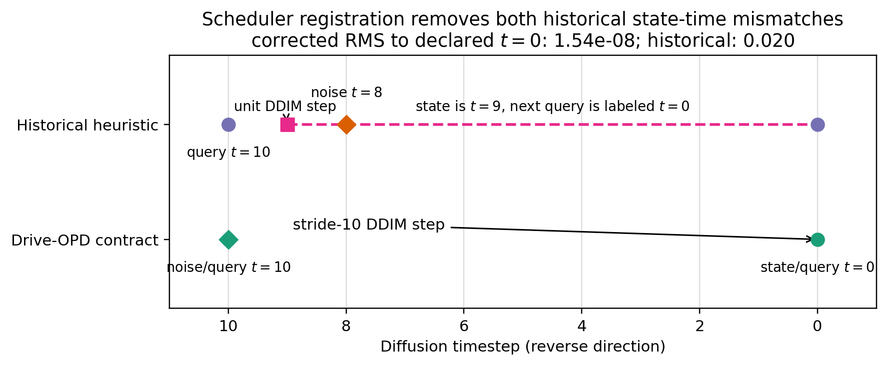
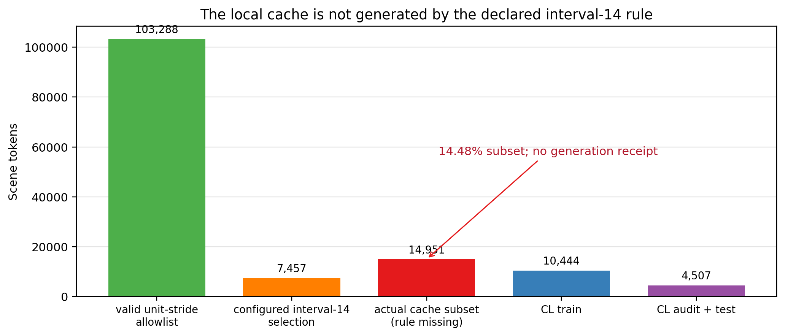
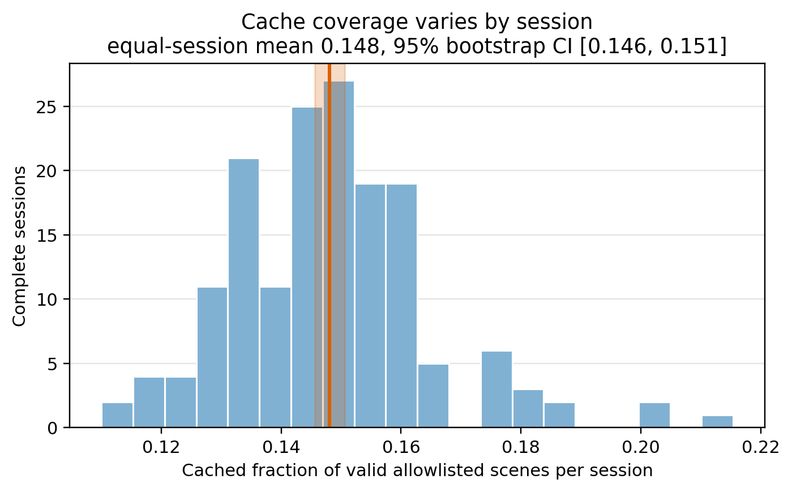

# P001 Results and Analysis

## 1. Scheduler consistency passes without extra denoiser queries

Table P001-A and Figure 1 show both historical mismatches. The old pipeline adds noise at (t=8) but
queries (t=10). With 1,000 inference steps, the first DDIM call maps (10\to9), although the next
denoiser is labeled (t=0). Under identical clean states and noise, its returned tensor is 0.0198078
RMS from the declared (t=0) reference.

The corrected scheduler uses 100 inference steps, so the first call has stride 10 and maps (10\to0).
Its RMS to the declared (t=0) reference is (1.538\times10^{-8}), below the preregistered
(10^{-6}) tolerance. It still performs exactly two student and two teacher denoiser queries. The
result establishes implementation validity and fair query count; it does not establish better PDMS.

## 2. The local data-provenance hypothesis fails

All 103,288 configured allowlist tokens occur in the 1,192 configured raw logs and are valid
unit-stride 14-frame windows. The declared `frame_interval=14` rule selects 7,457 scenes. The existing
cache instead contains 14,951 scenes, all valid allowlist members but only 1,288 of the interval-14
sample. Thus the cache is neither the full allowlist nor the declared subsample.

The cache and full CL manifest are exactly equal in token set and token-to-log mapping (both token-set
SHA256 `448991202f3422608cdbd56abd8d49017046aaafc4e3d30d055aff7bb2fe465f`). The 10,444
portable training tokens are exactly the disjoint union of three train cells; audit and test contain
1,512 and 2,995 tokens. Therefore the earlier arithmetic is internally correct but its source subset
is not reproducible: `valid_cache_train.pkl` indexes already-existing complete cache directories and
contains no selection rule, seed, or generation receipt.

The cache fraction varies from 0.1100 to 0.2154 across sessions. Its equal-session mean is 0.1481
(descriptive 95% bootstrap CI [0.1456, 0.1506]). Modest coverage variation does not prove harmful
selection bias; the missing rule nevertheless prevents a reviewer from reconstructing which scenes
could enter the experiment.

## 3. Alternative explanations

- **“14,951 is simply interval-7 sampling.”** Rejected: interval-7 reconstruction yields 14,810
  scenes but overlaps only 2,396 cache tokens.
- **“The cache is a deterministic lexicographic or hash prefix.”** Diagnostic checks of token order,
  SHA256 rank, and MD5 rank recover only chance-level overlap (14.35–14.72%), not the exact set.
- **“The cache and manifest disagree.”** Rejected by exact token and log-map equality.
- **“The 10,444 count indicates missing data.”** Rejected: it is exactly the training split; the
  remaining 4,507 scenes are audit/test by construction.
- **“Uniform-looking coverage makes provenance unnecessary.”** Rejected as a reproducibility claim.
  Similar aggregate fractions do not identify the scene-selection mechanism or its dependence on
  sensor/cache failures.

## 4. Consequences for the paper

The scheduler, EWC, A-GEM, and statistical contracts are promoted to the main implementation. The
existing modified-RAP OPD/LwF rankings remain historical diagnostics because they were trained with
the old schedule and the undeclared cache subset. P002 is not allowed to produce a pristine-main-table
claim until 06G replays the official source config/loader, emits a cache-generation receipt, and the
CL manifests are regenerated from that exact inventory.

The preferred 06G path is the complete scene set produced by the frozen official recipe. If its
storage or time cost is unacceptable, a deterministic subset rule must be preregistered before cache
construction; a post-hoc copy of the 14,951-token set is not acceptable.
